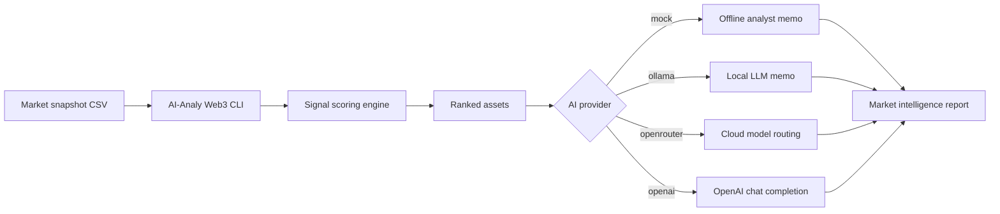

# AI-Analy Web3


**AI-Analy Web3** is a small open-source AI market intelligence toolkit for Web3 builders. It ranks token market signals, labels market phases, and generates an AI analyst memo using either an offline mock engine, a local Ollama model, OpenRouter, or OpenAI.

The project is written as a simple core layer that could sit behind a Web3 dashboard, market-maker assistant, Telegram bot, Discord alert bot, or Dessistant-style AI product. It does not try to be a trading oracle. It shows the backbone of an explainable market analysis pipeline: raw market snapshot in, ranked signal intelligence out.

## What It Analyzes

```json
{
  "asset": "FET",
  "score": 87.68,
  "phase": "breakout-watch",
  "price_usd": 2.36,
  "change_24h": 14.6,
  "volume_change": 48.5,
  "liquidity_score": 66.0,
  "narrative": "autonomous AI economy"
}
```

Each asset is scored from a market snapshot using:

- 24h price movement
- volume expansion
- liquidity depth
- holder growth
- social attention
- Web3 narrative category

The output is structured JSON, so it can be plugged into dashboards, bots, research notebooks, or alert systems.

## Why This Project Exists

Most Web3 AI demos stop at a chatbot prompt. Real market tools need a more useful core:

- normalize noisy token data
- rank market signals consistently
- explain why a token is moving
- separate momentum from liquidity risk
- support local AI for private research
- support hosted models when teams want better reasoning

AI-Analy Web3 keeps the logic inspectable. The scoring model is readable, the provider layer is small, and the default mode runs offline without keys.

## Architecture



## Quick Start

Run offline with the built-in mock memo:

```bash
python3 main.py
```

Return structured JSON:

```bash
python3 main.py --json
```

Run with local AI:

```bash
ollama serve
ollama pull llama3.2
python3 main.py --provider ollama --model llama3.2
```

Run with OpenRouter:

```bash
export OPENROUTER_API_KEY="your-key"
python3 main.py --provider openrouter --model openai/gpt-4o-mini
```

Run with OpenAI:

```bash
export OPENAI_API_KEY="your-key"
python3 main.py --provider openai --model gpt-4o-mini
```

## Example Output

```text
AI-Analy Web3
Web3 Market Intelligence Snapshot

1. FET | score=87.68 | phase=breakout-watch
   autonomous AI economy | 24h=14.6% | volume=48.5%
2. DESAI | score=84.02 | phase=breakout-watch
   AI agent infrastructure | 24h=18.4% | volume=42.0%
3. SOL | score=80.39 | phase=breakout-watch
   high-throughput consumer apps | 24h=6.1% | volume=18.2%

AI Memo (mock)
FET is the strongest current signal with a 87.68 breakout-watch score...
```

## Market Phases

```text
breakout-watch  strong momentum and attention
accumulation    healthy signal with room to develop
neutral         mixed or baseline market behavior
risk-off        weak signal or liquidity pressure
```

## Provider Modes

```text
mock       Offline deterministic memo, no API key required.
ollama     Local model inference through http://localhost:11434.
openrouter Hosted model routing through OpenRouter.
openai     Direct OpenAI-compatible chat completion.
```

## Project Structure

```text
ai-analy-web3/
├── main.py
├── data/
│   └── web3_market_snapshot.csv
└── README.md
```

## Notes

This project starts from a sample market snapshot, which means it can be connected to live data later. The current focus is the analysis layer: scoring market signals, producing phase labels, and routing the result into an AI memo.

Good data sources to add later:

- CoinGecko or DexScreener prices
- DEX liquidity and volume feeds
- holder concentration metrics
- funding rate and open interest
- Telegram, Discord, and X sentiment
- project docs, tokenomics, and governance proposals

## Future Improvements

- Add live market data ingestion.
- Add backtesting for signal stability.
- Add a plugin API for custom risk modules.
- Add historical market regime memory.
- Add RAG over token docs and governance proposals.
- Export reports to Markdown, JSON, or Telegram alerts.
- Add a dashboard for market-maker and community teams.

## GitHub Description

```text
Open-source Web3 AI market intelligence toolkit with Ollama, OpenRouter, and OpenAI provider adapters.
```

## Disclaimer

AI-Analy Web3 is a research and developer tool. It does not provide financial advice, trading recommendations, or guarantees about market behavior.
